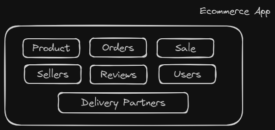

### Class
>A class is a blueprint which you use to create objects.
>It has attributes and methods

### Object
> An object is an instance of a class.
> It implements the methods/behaviours using the attributes/properties of class.
> It occupies space in memory but Class doesn't.

### Characteristics of OOP
- Abstraction : Core Principle 
- Encapsulation --- 1st Pillar 
- Polymorphism --- 2nd Pillar
- Inheritance --- 3rd Pillar
---
### Abstraction
- '**Abstract**' : idea or something not in existence.
- Abstraction asks us to envision a complex system in terms of ideas.
- Hiding complex data/details

- Secure the code so that world don't know the inside of the system.
### Encapsulation
- Hold attributes and behaviours together.
- It is achieved by class.
- Protects attributes and behaviours.