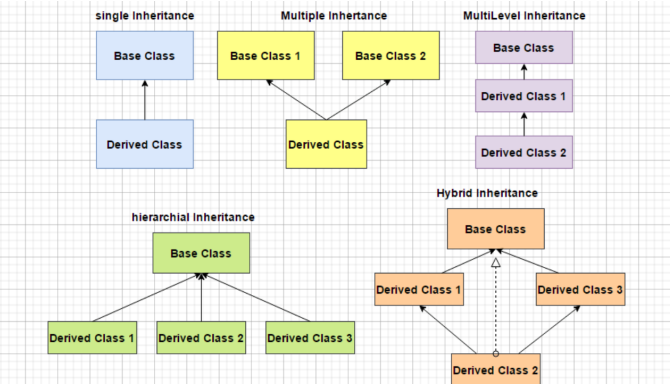
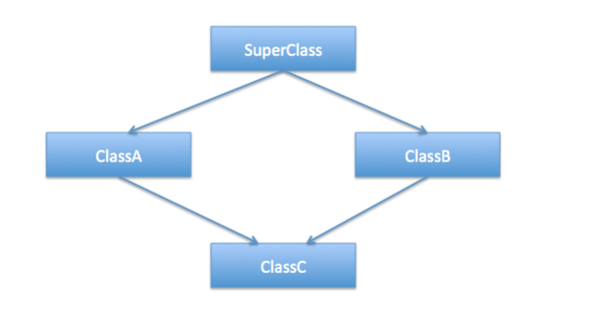

### Inheritance
Inheritance is the mechanism that allows one class to acquire all the properties from another class by
inheriting the class. We call the inheriting class a child class and the inherited class as the superclass or
parent class.


The idea behind inheritance in Java is that you can create new classes that are built upon existing classes.
When you inherit from an existing class, you can reuse methods and fields of the parent class. Moreover,
you can add new methods and fields in your current class also.

Inheritance represents the IS-A relationship which is also known as a parent-child relationship.

Imagine, as a car manufacturer, you offer multiple car models to your customers. Even though different car
models might offer different features like a sunroof or bulletproof windows, they would all include common
components and features, like engine and wheels.
It makes sense to create a basic design and extend it to create their specialized versions, rather than
designing each car model separately, from scratch.

Similarly, with inheritance, we can create a class with basic features and behavior and create its specialized
versions, by creating classes, that inherit this base class. In the same way, interfaces can extend existing interfaces.

Let us create a new class User which should be the parent class of Student:
```java
public class User {
 private String name;
 private String email;
 public User(String name, String email) {
 this.name = name;
 this.email = email;
 }
}

```

Now, let us create a new class Student which should be the child class of User. Let us add some methods
specific to the student class:
```java
public class Student {
 private String batchName;
 private Integer psp;
 //....
}
```
Now in order to inherit the methods and fields of the parent class, we need to use the keyword extends:

```java
public class Student extends User {
 private String batchName;
 private Integer psp;

 //...
}
```
To pass the values to the parent class, we need to create a constructor and use the keyword super:
```java
public class Student extends User {
    private String batchName;
    private Integer psp;

    public Student(String name, String email, String batchName, Integer
            psp) {
        super(name, email);
        this.batchName = batchName;
        this.psp = psp;
    }
}
```
### Types of inheritance
There are four types of inheritance:
- Single - A single inheritance is when a class can have only one parent class.
- Multilevel - A multilevel inheritance is when a class can have multiple parent classes at different
levels.
- Hierarchical - When two or more classes inherits a single class, it is known as hierarchical
inheritance.
- Multiple - When a class can have multiple parent classes, it is known as multiple inheritance.


### Diamond problem
In multiple inheritance one class inherits the properties of multiple classes. In other words, in multiple
inheritance we can have one child class and n number of parent classes. Java does not support multiple
inheritance (with classes).

The "diamond problem" (sometimes referred to as the "Deadly Diamond of Death") is an ambiguity that
arises when two classes B and C inherit from A, and class D inherits from both B and C. If there is a method
in A that B and C have overridden, and D does not override it, then which version of the method does D
inherit: that of B, or that of C.
