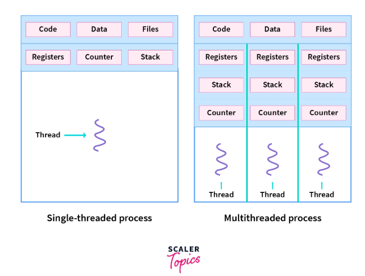
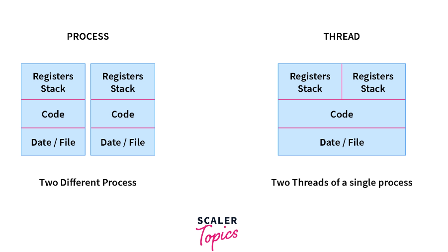

### Threads
>A thread is a lightweight process. It is a unit of execution within a process. A process can have multiple threads. Each thread has its own program counter, stack, and registers. Threads share the same address space. This means that all threads in a process can access the same memory. This is different from processes where each process has its own address space.

Often, a process needs to perform multiple tasks at the same time. For example, a web browser needs to download a file and display a web page at the same time. Creating a new process for each task is expensive. This is because creating a new process requires a lot of resources.

Threads are used to solve this problem. Threads are used to perform multiple tasks within a process. This is done by sharing the same address space. This means that all threads in a process can access the same memory. This is different from processes where each process has its own address space.

Thread is a sequential flow of tasks within a process. Threads in OS can be of the same or different types. Threads are used to increase the performance of the applications. Each thread has its own program counter, stack, and set of registers. But the threads of a single process might share the same code and data/file. Threads are also termed as lightweight processes as they share common resources.

#### Processes
| Feature                   | Description                    |
|---------------------------|--------------------------------|
| Resource Usage (Weight)   | Heavyweight processes          |
| Creation/Termination Time | Slower                         |
| Code and Data/File        | Own code and data/file         |
| Communication Speed       | Slower                         |
| Context Switching Speed   | Slower                         |
| Independence              | Independent of each other      |
| Example                   | Opening two different browsers |

#### Threads
| Feature                   | Description                               |
|---------------------------|-------------------------------------------|
| Resource Usage (Weight)   | Lightweight processes                     |
| Creation/Termination Time | Faster                                    |
| Code and Data/File        | Share code and data/file within a process |
| Communication Speed       | Faster                                    |
| Context Switching Speed   | Faster                                    |
| Interdependence           | Interdependent (can read, write, or change another thread’s data)                |
| Example                   | Opening two tabs in the same browser          |

-----

### Concurrency vs Parallelism
- Concurrent - At the same time, but not necessarily at the same instant. It is possible for multiple threads to be at different stages of execution at the same time but not being processed together. A single core CPU can only execute one thread at a time. But it can switch between threads very quickly. This is called context switching. This is how concurrency is achieved. A single core CPU can have concurrency but not parallelism.
- Parallel - At the same time and at the same instant. It is possible for multiple threads to be at different stages of execution at the same time and being processed together. A single core CPU cannot achieve parallelism. It can only achieve concurrency. A multi-core CPU can achieve both concurrency and parallelism.
