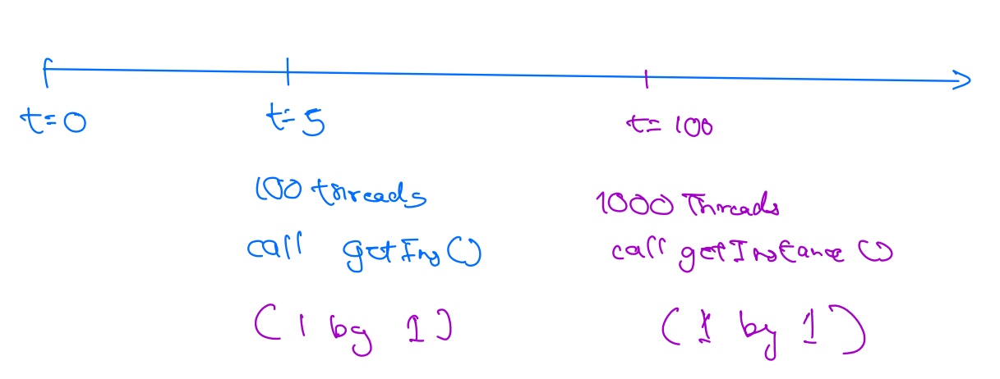
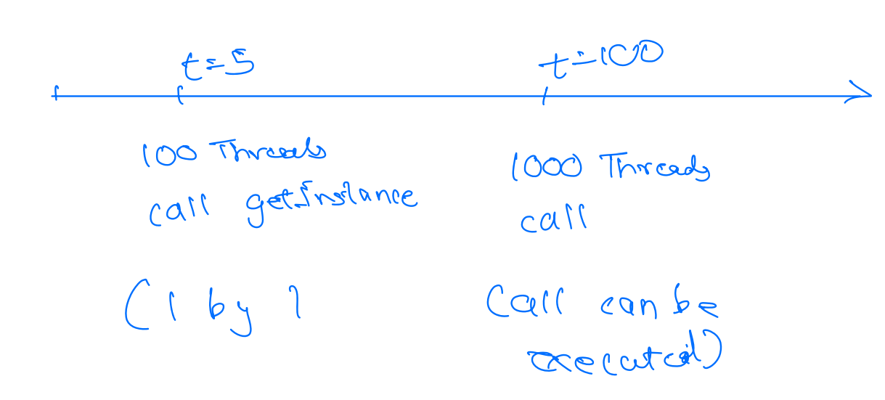

The simplest design pattern.It ensures that a class has only one instance and provides a global point of access to that
instance. It is particularly useful when exactly one object is needed to coordinate actions across the system, such as
managing a shared resource or controlling access to a resource.

## **Problem**
- **Shared Resources** - Imagine you have a class that is responsible for managing the database connection. You want
to make sure that only one instance of this class exists in your application.If you create multiple instances of this
class, you will end up with multiple database connections, which is not what you want. Similarly, there can be a class
that is responsible for managing the logging mechanism. You want to make sure that only one instance of this class
exists in your application. If you create multiple instances of this class, you will end up with multiple log files,
which is not what you want.
- **Single Access Point**- Applications often require configuration. For example, you might want to
  configure the database connection parameters. You want to make sure that only one instance of this class exists in
your application. A configuration class should have a single access point to the
  configuration parameters. If you create multiple instances of this class, you will end up with multiple
  configuration files.

## **Solution**
- Hiding Constructor
- Making global access point
```java
public class Database{
    private Database(){}//constructor hidden
    private static Database INSTANCE=null;
    public static Database getInstance(){ //Gloabl accces
        if(INSTANCE==null){
            INSTANCE= new Database();
        }
        return INSTANCE;
    }
}
```
Above code will work fine but will fail in multithreading environment.
So to overcome that we can use

- ### Eager Initialization
  The singleton object will be created eagerly i.e. at the time of loading class.This ensures that the instance is
  always available and initialized when the class is first accessed.
```java
public class Database{
    private Database(){}//constructor hidden
    private static Database INSTANCE=new Database();
    public static Database getInstance(){ //Gloabl accces
        return INSTANCE;
    }
}
```
  **Pros:**
  - Supports Multithreading
  - Truly Singleton

  **Cons:**
  - Object is created way too early from its use, which will consume memory.
  - Cannot paas any parameters while object creation.


- ### Synchronised method
  mark `getInstance` method as `synchronised`
  
  **Pros**:
  - Support multithreading
  
  **Cons**:
  - Super slow


- ### Double Check Locking (DCL)
  is a design pattern used to lazily initialize an object while ensuring thread safety. It aims to minimize
synchronization overhead by only synchronizing the critical section of code when necessary. The double-check refers to
performing a null check both outside and inside a synchronized block.
``` java
if(INSTANCE==null){
    synchronized (DBC.class){
        if(INSTANCE==null){
            INSTANCE=new Database();
        }
    }
}
return INSTANCE;
```
