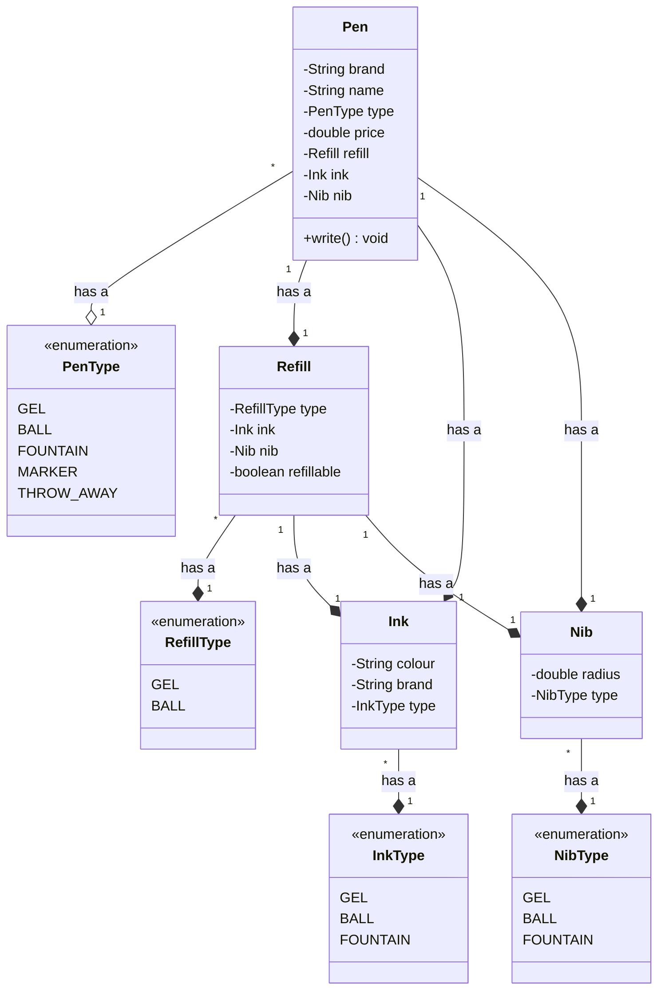
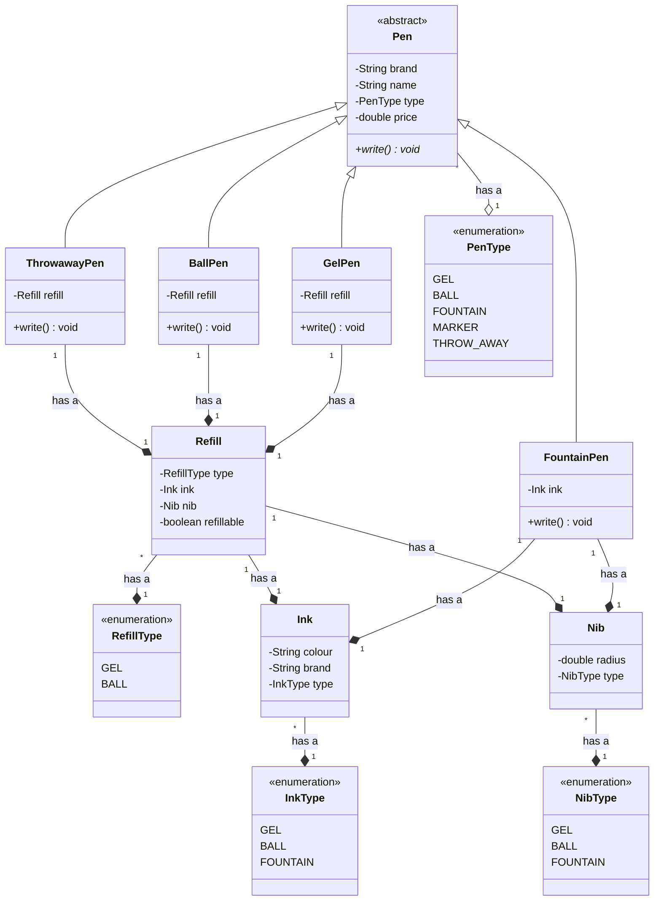
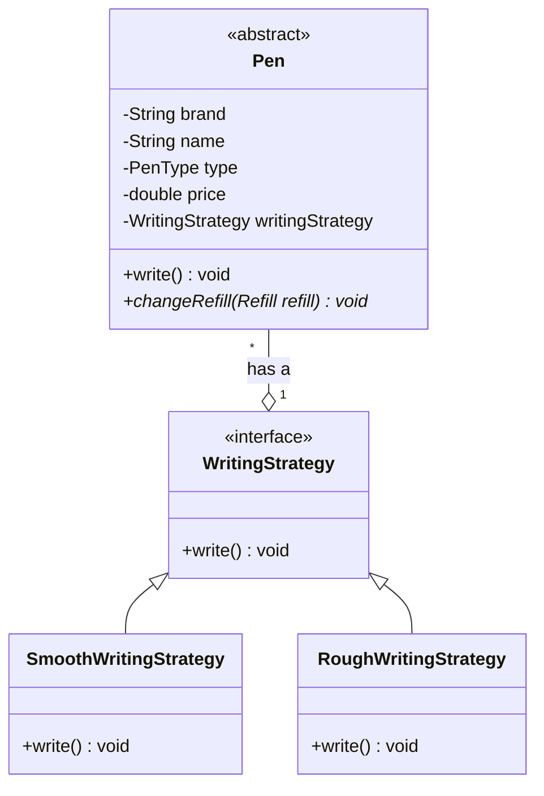
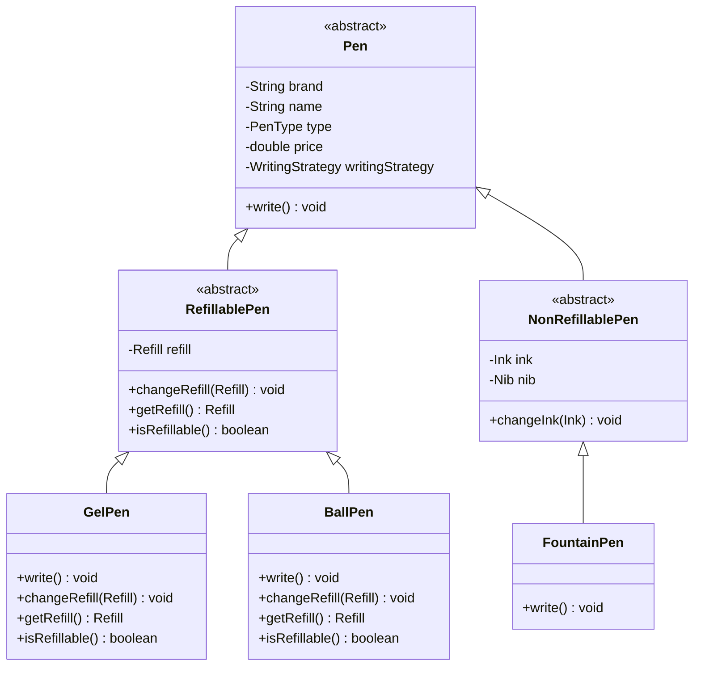
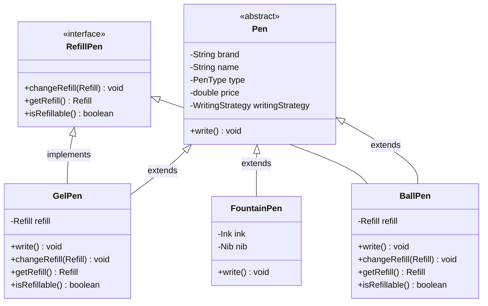

In machine coding round the `design` and `implementation` knowledge is evaluated.

- In machine coding round, generally **`one line problem`** statement will be given.
- We will ask questions to get the **`requirements`** details from
interviewer. Questions will involve **`current scope`** , `**Future Scope**` and `**Behavior**`
- `Entities` will be defined through the requirements.
- **`UML diagrams`** will be implemented based on requirements.
- After iteration best design should be `implemented` in code. 

# Designing a Pen: Case Study 

### Step 1: Problem Statement
- Design a pen.

### Step 2: Requirements
- A pen is anything that can write.
- Pen can be Gel, Ball, Fountain, Marker.
- Ball pen have ball pen refill and gel pen have gel pen refill.
- A refill has a tip and ink.
- Ink can be of different colour.
- A fountain pen has an Ink.
- Refill has radius.
- For fountain pen, its tip has a radius.
- Each pen can write in a different way.
- Some pens write in the same way.
- Every pen has a brand and a name.
- Some pens may allow refilling while others might not.

### Step 3: Entities and attributes.
 **Nouns** will be the entities.
1. Pen
2. Refill
3. Ink
4. Nib

- Pen has
  - Brand
  - Name
  - Type (Ball,Gel,Fountain,Throwable)
  - Price
  - Refill has
    - Ink has
      - Colour
      - Brand
      - Type (Ball,Gel,Type)
    - Nib has
      - Radius
      - Type (Ball,Gel,Type)

### Step 3: Class Diagram

>Version 1

### Problems
- **Single Responsibility Principle** is violated. There are multiple reasons to change the class such as modifying a single type of pen.
- **Open Closed Principle** is violated. Adding a new type of pen requires changing the class.
- **Null checks** are required for handling refill and ink for fountain pens.
- **Object creation** is complex

>Version 2
To overcome the above problems we use `Inheritance`

### Problems
- Object creation is still complex.
- Liskov Substitution Principle is violated since FountainPen does not have a refill, and it throws an exception when
changeRefill is called.
- Code duplication
- Subclasses are used to create objects.

>Version 3

>Version 4

>Version 5
