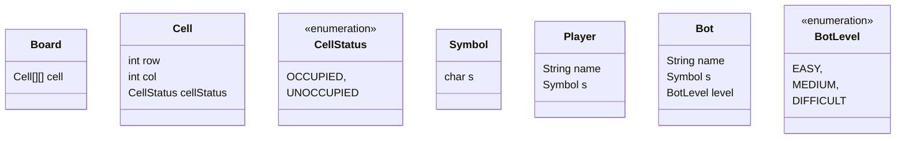
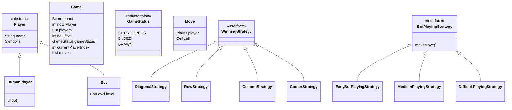

## Step 1: Requirement Gathering

>Do we know the system:
- Yes
- No

Get sync with the interviewer.

> Identify the system

Types of system:
- Entity
- Real life system
- Real time/Interactive Game
- Engineering Problem

>Requirements
- We should support n*n board.
- n-1 players  can play at a time.
- Before any game starts, player chooses their symbol. Symbol can be alphanumeric character.
- Randomize the list of players before game starts.
- Winning conditions: row,col,diagonal,all the four corners.
- A game ends when 1 of the player wins or if there are no moves left,which means draw.
- Do we support undo feature : Y
- Are games timed: N
- Player profile: N
- Re-watch/ Replay the game: Y
- Do we support Bots: Y
- Level of Bots: EASY,MEDIUM,DIFFICULT

> Important requirements in game system.
- Board Size
- Number of players
- How game starts
- How game ends
- Player profile
- Tournament / Matches
- Undo
- Re-watch
- Bots

```
Note: Try to cover core features + 2-3 additional features in a design interview.
```

## Step 2: Clarify Requirements
- How is undo going to work?Will there be infinite number of undo(s). Per game per player: 2 undo(s) allowed.
- How many bots per game? 0/1
- Bots cannot undo, only humans can.

## Step 3: Use case Diagram

## Step 4: Class Diagram

We wil figure out the nouns from our requirements and make class out of those.
Nouns:
- Board
- Player
- Game
- Symbol
- Bot




