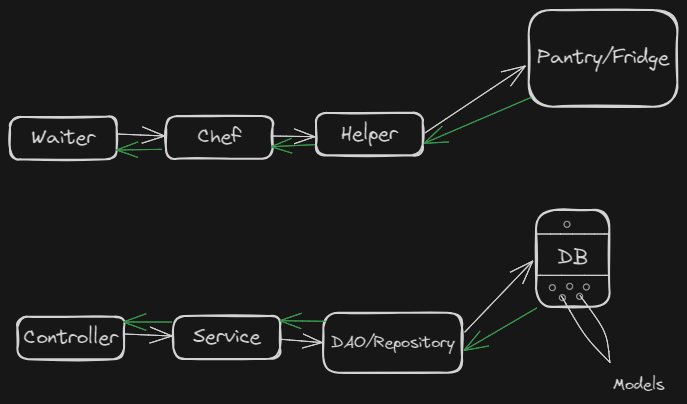
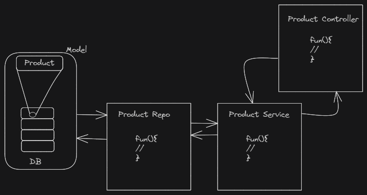

### Model-View-Controller (MVC)
Design pattern commonly used

1. **Model** : Represents the application's data.
2. **View** : Represents the user interface.It displays data from model to user and sends user actions to the controller.
3. **Controller** : Acts as intermediary between model and view.





#### Structure of MVC app
```
    /app
        /models
            class1
            ....
        /controllers
            class1
            ....
        /services
            class1
            ....
        /repos
            class1
            ....
```