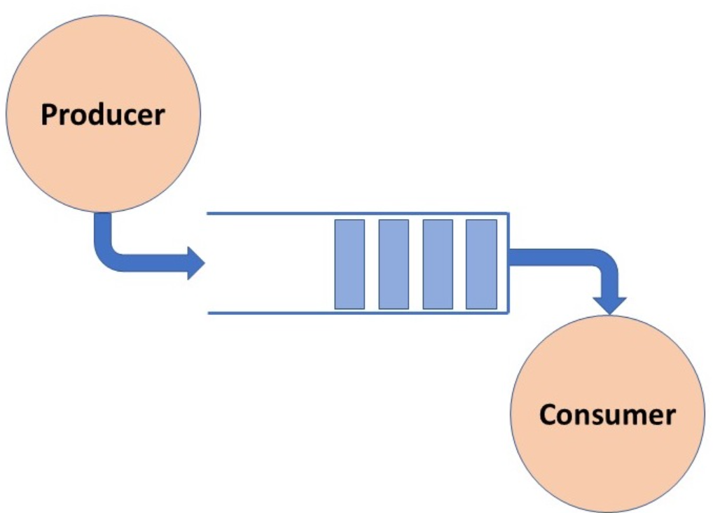

The Producer-Consumer problem is a classical multi-process synchronization problem, that is we are trying to achieve
synchronization between more than one process.

There is one Producer in the producer-consumer problem, Producer is producing some items, whereas there is one Consumer
that is consuming the items produced by the Producer. The same memory buffer is shared by both producers and consumers
which is of fixed-size.

The task of the Producer is to produce the item, put it into the memory buffer, and again start producing items.
Whereas the task of the Consumer is to consume the item from the memory buffer.

