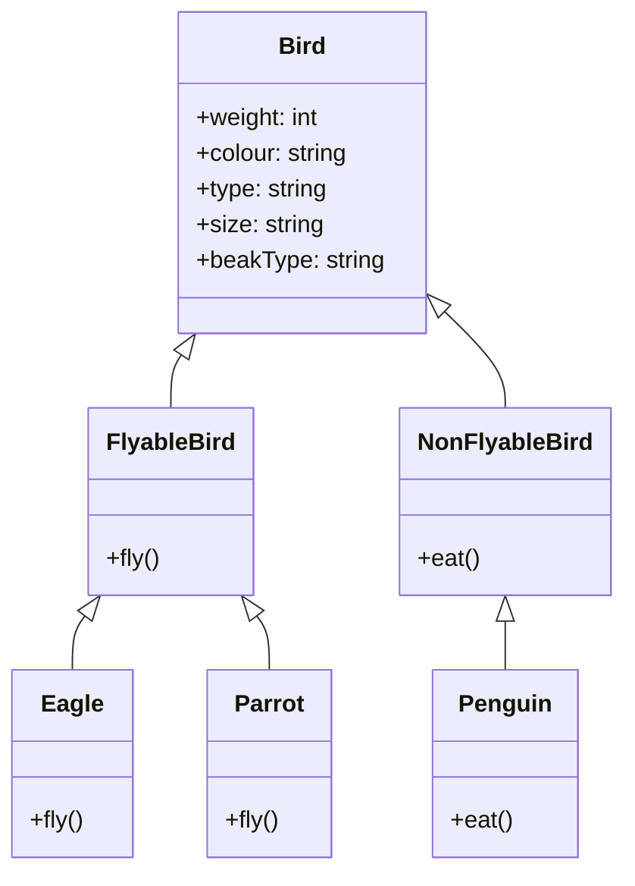
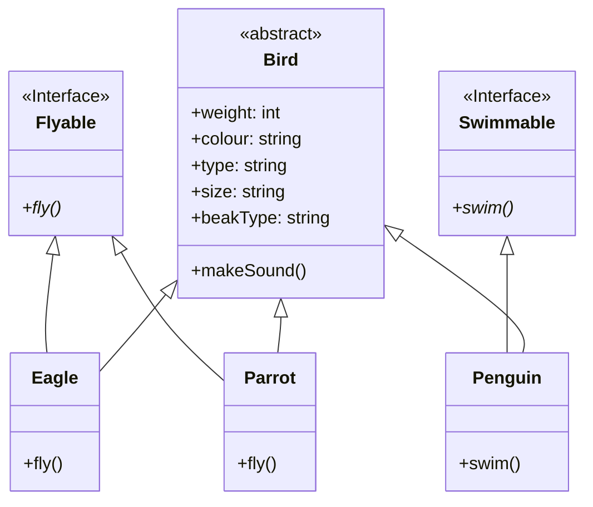

### Liskov's Substitution Principle (LSP)

In the previous version of our code we have seen that we have inherited `fly()` method from abstract class `Bird` to all
our separate birds.

What if I want to add penguins? Will they fly!!?? `No`, right.So we cannot override the `fly()` method for penguin.
So I will try to solve this issue:
1. By throwing error
2. Return null
3. Dummy method

So to overcome all these challenges, our third solid principle `LSP` is used.

>  objects of a superclass should be replaceable with objects of its subclasses without altering the correctness of the
> program.
Examples:

A "Shape" superclass with "draw()" method. Subclasses like "Rectangle" and "Circle" override "draw()" but maintain its 
meaning (drawing shapes). This adheres to LSP.
A "FlyingBird" superclass with a "fly()" method. A "Penguin" subclass inherits but cannot fly. This violates LSP as it 
breaks the expected behavior.

This is an example of multi-level inheritance.
The issue with the above approach is that we are tying behaviour to the class hierarchy.
If we want to add a new type of behaviour, we will have to add a new abstract class. This is why we should not tie behaviour to the class hierarchy.

Creating new interfaces
We can solve the issue with the Penguin class by creating new interfaces. We can create an Flyable interface and an Swimmable interface. The Penguin class will implement the Swimmable interface and the Eagle and Parrot classes will implement the Flyable interface. This way, we can ensure that the Penguin class does not have to implement the fly() method.

Since we are not tying behaviour to the class hierarchy, we can add new types of behaviour without having to add new abstract classes. For instance, if we want to add a new type of behaviour, we can create a new interface CanSing and add it to the class hierarchy.

### Summary
- The Liskov Substitution Principle states that objects in a program should be replaceable with instances of their subtypes without altering the correctness of that program.
- To identify violations, we can check if we can replace a class with its subclasses having to handle special cases and expect the same behaviour.
- Prefer using interfaces over abstract classes to implement behaviour since abstract classes tend to tie behaviour to the class hierarchy.

So the implemented LSP code [Version 3](../../code/LSP/v3/Bird.java)