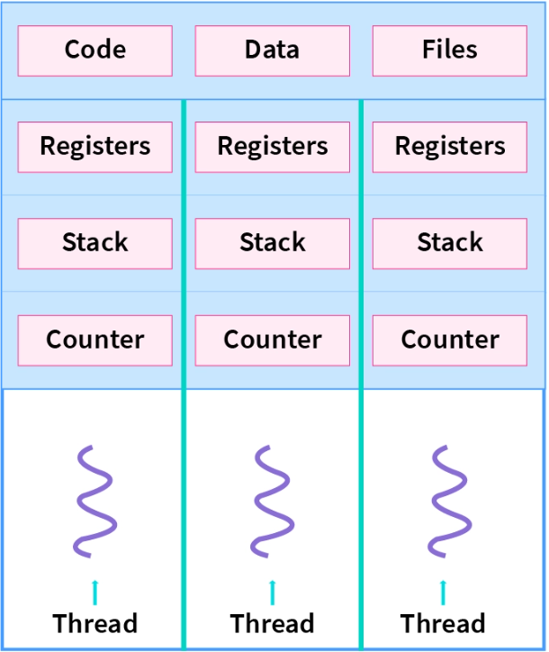

### Threads
- are the smallest unit of execution within a process.
- within a process share the same resources,but each threads has its own execution context.
- are used for concurrent or parallel execution of tasks in a program.



### Thread can be created by:
- Extending the `Thread` class.
```java
public class NewThread extends Thread{
    @Override
    public void run() {
        System.out.println("Thread :"+Thread.currentThread().getName());
    }
}

public class Main {
    public static void main(String[] args) {
        System.out.println("Thread :"+Thread.currentThread().getName());
        Thread thread=new NewThread();
        thread.start();
    }
}
// -- Output--
//Thread :main
//Thread :Thread-0
```
>When you execute a Java program, the main thread is the first thread to start executing the code in the main method.


- Implementing `Runnable` interface.
```java
public class NewThread implements Runnable {
    @Override
    public void run() {
        System.out.println("thread : "+Thread.currentThread().getName());
    }
}
public class Main {
    public static void main(String[] args) {
        Runnable thread=new NewThread();
        Thread t1=new Thread(thread);
        t1.start();
    }
}
// -- Output --
// thread : Thread-0
```
> If thread created through `Runnable` interface then we have to provide a Runnable task in `Thread` as parameter

To run the thread we use `start()` method on thread object.

### Practice
- [Assignment 1](/code/MultithreadingandConcurrency/Runnable/Assignment1)
- [Assignment 2](/code/MultithreadingandConcurrency/Runnable/Assignment2)